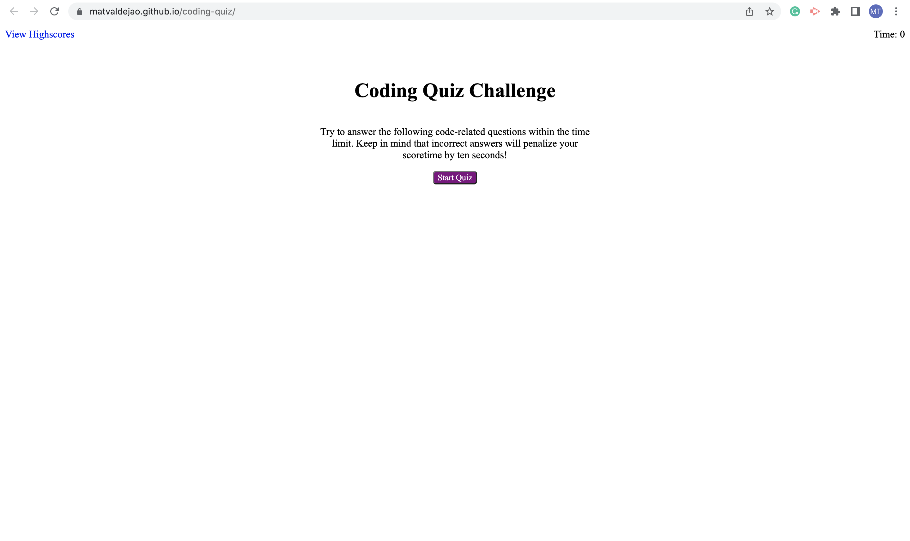

# coding-quiz

## Purpose
The purpose of this website is to provide the user with an interactive and simple coding quiz (that can be expanded with more questions if desired). Once the user chooses to begin playing, a question is displayed with four answer options for the user to choose from. Choosing an answer will prompt the game to evaluate whether the input is the correct answer and, if the answer is wrong, subtract ten seconds from a running timer. Once the user reaches the end of the quiz, the user can save their score to local storage by inputing their initials. 

Once the page is reloaded, the previous attempts and scores are retrieved from storage in order to provide continuation to the game so that the user can compare scores and check whether they are progressing. If desired, the user also has the option to clear history and start fresh.

## Built With 
 * HTML
 * CSS 
 * JavaScript

 ## Website
 https://matvaldejao.github.io/coding-quiz/

 ## Website Screenshot 
 